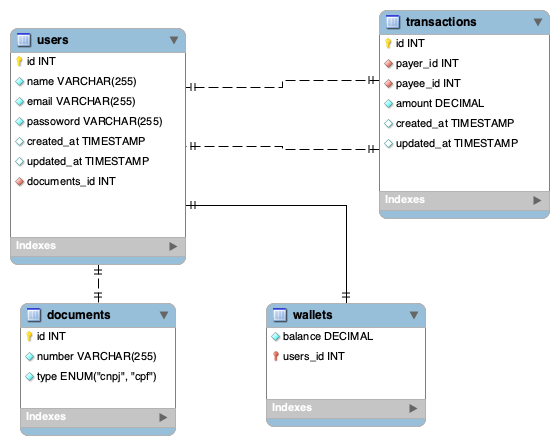
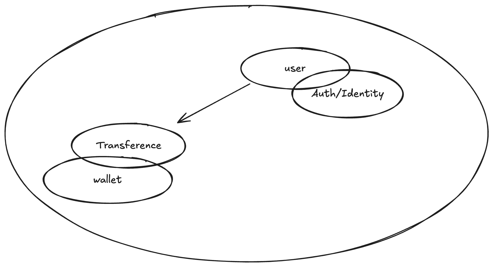

## Wallet

O projeto foi desenvolvido usando PHP e MYSQL. O docker foi utilizado para facilitar a configuração do ambiente de desenvolvimento.

## Diagrama do banco de dados:


## DDD Estratégico:


### Endpoint Transfer

O endpoint transfer permite realizar uma transferência entre contas.
````
POST  /api/transfer

payer_id (integer): ID da conta de origem.
payee_id (integer): ID da conta de destino.
amount (float): Valor a ser transferido.
````

Exemplo de requisição
````json
{
    "payer_id": 1,
    "payee_id": 2,
    "amount": 100.50
}
````

Respostas

200 OK: Transferência realizada com sucesso.

400 Bad Request: Dados inválidos ou saldo insuficiente.

404 Not Found: Conta de origem ou destino não encontrada.
